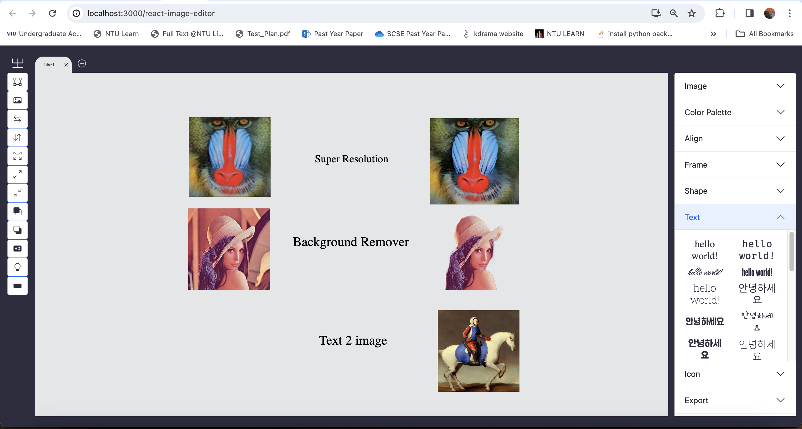
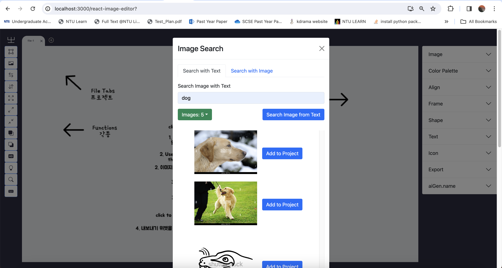
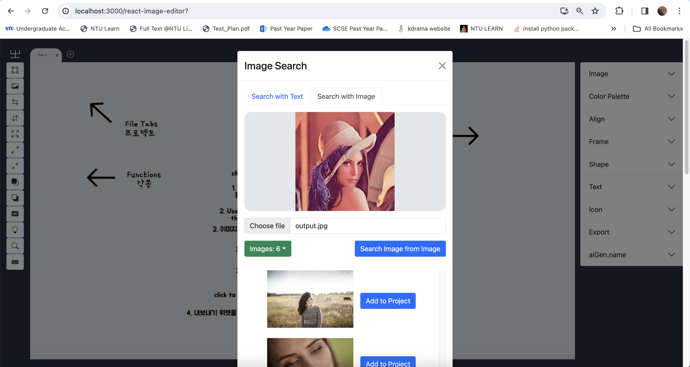
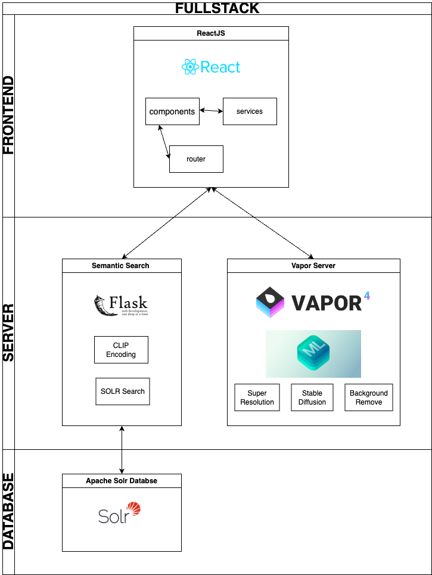

# React Based Image Editor with Core ML services

This project involves a fullstack application that uses Vapor to server CoreML services as RestAPIs to a frontend React Application and a Apache Solr Image Search Server.
CoreML models are obtained from the [CoreML Zoo](https://github.com/john-rocky/CoreML-Models).  
The Frontend UI is an image editor, special thanks to swimmingkiim.
The original repository for the UI can be found here: https://github.com/swimmingkiim/react-image-editor

## CoreML Model Services

Core ML services are based off traditional Pytorch / Tensorflow models which have been converted to Core ML format and deployed on a Vapor 4 microservices server.

### Background Remover

Model: U2 Net

### Super Resolution

Model: realesrgan512

### Stable Diffusion

Model: stableDiffusion1.5



## Image Search Services

Model: [openai/clip-vit-base-patch32](https://huggingface.co/openai/clip-vit-base-patch32)  
Dataset: [conceptual_captions](https://huggingface.co/datasets/conceptual_captions)  
Only 1000 images from this dataset has been added to the Solr Database

### Text to Image



### Image to Image



## Application Architecture



## Installation and Running the model

### Clone Main Repository

```
git clone https://github.com/weepots/macosai.git
cd macosai

```

### Clone CoreML Vapor Server

```
git clone https://github.com/weepots/coreml_server/tree/32cbd0b58b3c316f73b7a03301bc83878100451c
```

### Start CoreML Vapor Server

```
cd coreml_server
code .
```

Build and Run in Xcode

### Start React Frontend Image Editor

```
cd frontend
npm install
npm start

```

### Start Clip Service

```
cd clip_service
python -m venv fastvenv
source venv/bin/activate
pip install -r requirements.txt
python server.py
```

### Start Solr Service

```
cd solr_search
bin/solr start
```
