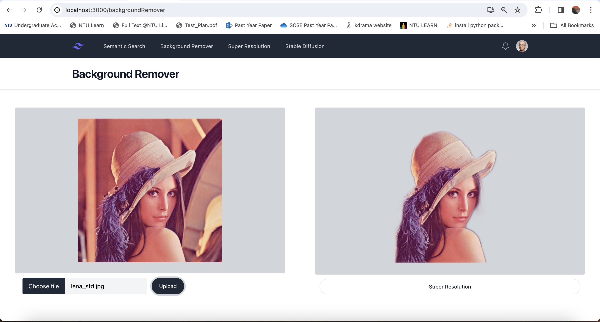
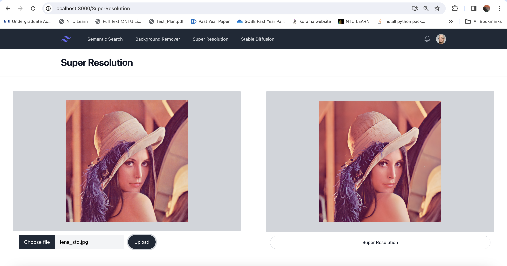
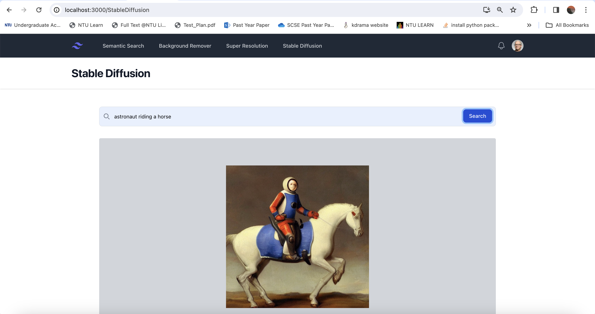

# macosai
Final Year Project
This project involves a fullstack application that uses Vapor to server CoreML services as RestAPIs to a frontend React Application.
CoreML models are obtained from the CoreML zoo. The Frontend UI is an image editor, special thanks to swimmingkiim. 
The original repository for the UI can be found here: https://github.com/swimmingkiim/react-image-editor

## CoreML Model Services
### Background Remover
Model: U2 Net

### Super Resolution
Model: realesrgan512

### Stable Diffusion
Model: stableDiffusion1.5

